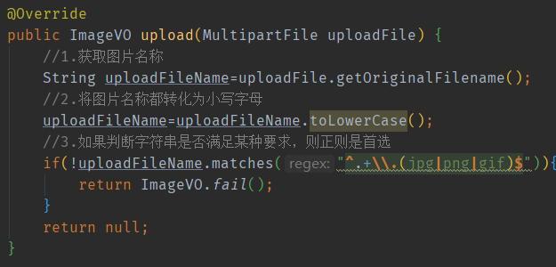

# :recycle:Code-library
代码库，收录历史代码和能够用的到的代码。重用

## :heart:基础

- 字符串拼接

- 递归求总目录大小

- 常见的字符编码表

- **如果要判断大小写，可以全部转大写或全部转小写，再去判断**

- 属性赋值之连续赋值操作

  ```java
  ItemDesc itemDesc=new ItemDesc();
  itemDesc.setItemId(101L).setItemDesc("属性测试").setCreated(new Date()).setUpdated(itemDesc.getCreated());
  
  ```

- [以空间换时间法](https://github.com/helloGitHubQ/CodeLibrary/tree/master/base/timeSpace.md)

- HttpClient

  - HttpClientClose
  - HttpClientConfig

## :triangular_flag_on_post:项目经历

- Maven 项目配置参数后启动

- java 项目用Tomcat启动

## :smile:java经典导出POI 


## :boxing_glove:正则

- 如果判断字符串是否使用满足某种要求，则正则是首选。

  

- [身份证的正则]()

## :sparkles:线程

- 聊天室

- Callable

## :red_circle:框架

- springboot 启动类 / 测试类

- mybatis API 测试类